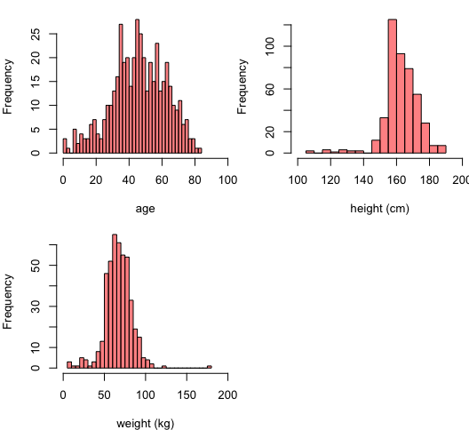

# Detection of cardiac arrhytmia: project overview
Heart arrhythmias are characterized by irregular heartbeats, which could also be too slow or too fast. In order to diagnose cardiac arrhythmia, the heart activity is analyzed by recording an electrocardiogram (ECG). The parameters of the ECG combined with patient information allows to detect and categorize arrhythmia. Unfortunately, false arrhythmia alarm rates as high as 88.8% have been reported in Intensive care units [1]. This has a negative impact on both patients and clinical staff and can result in true alarms being ignored. Guvenir et al created an arrhythmia dataset available in the UCl Machine Learning Repository [2]. They aimed at detecting the presence of cardiac arrhythmias and classify them in 16 groups.    
In this project, I used the same dataset to create a binary classifier that will distinguish between normal and anormal arrhythmias. This approach is due to the severe class imbalance noticed in the dataset. Before selecting the best classifiers and evaluating their performance, I conducted the following: data preprocessing, exploratory data analysis, feature selection and model tuning.    

## Resources
Python packages: Numpy, Scipy, Pandas, Seaborn, Matplotlib, Sklearn   
R packages: Party, Leaps, Caret, pROC, MLmetrics, glmnet   

## Data preprocessing and EDA (mainly on Jupyter notebook)

*   Removed outliers 
*   Dropped variables with missing values or applied KNN imputation
*   Dropped variables with zero/near-zero variance 
*	Removed features with high correlation (>0.9) 

Below are a few figures from the EDA. 

 

The two classes (anormal and normal) strongly overlap with the normal class contained within the anormal one. Therefore, it seems like classifiers such as linear SVMs or KNNs will not work well on this data. Radial SVMs could work but they will most likely have a lot of false negatives (anormal classified as normal). 

## Model training (on RStudio)
Data splitting: 70/30
Model tuning: 5 repeats of 10-fold cross-validation
Metric: AUC 

## Performance of the final models on the test set 

Random Forest
AUC: 0.86 

Logistic regression
AUC:.77

 
## Conclusion
Overall, the differences between the 2 models are not large although the random forest model is better at identifying anormal cases. The advantages of a logistic regression model are that it is more interpretable and faster compared to random forest models so it could be a good choice for the purpose of our application. The opinion of a specialist would be useful to interpret the variables and make a definite choice.

