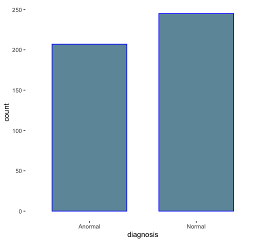
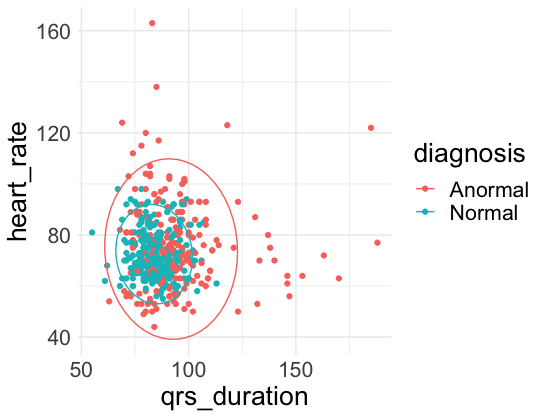
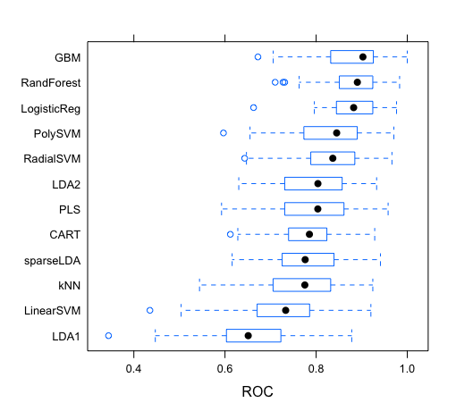
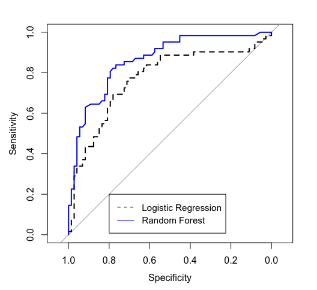

# Detection of cardiac arrhytmia: project overview
Heart arrhythmias are characterized by irregular heartbeats, which could also be too slow or too fast. In order to diagnose cardiac arrhythmia, the heart activity is analyzed by recording an electrocardiogram (ECG). The parameters of the ECG combined with patient information allows to detect and categorize arrhythmia. Unfortunately, false arrhythmia alarm rates as high as 88.8% have been reported in Intensive care units [1]. This has a negative impact on both patients and clinical staff and can result in true alarms being ignored.   
Guvenir et al created an arrhythmia dataset available in the UCl Machine Learning Repository [2]. They aimed at detecting the presence of cardiac arrhythmias and classify them in 16 groups.    
In this project, I used the same dataset to create a binary classifier that will distinguish between normal and anormal arrhythmias. This approach is due to the severe class imbalance noticed in the dataset. Before selecting the best classifiers and evaluating their performance, I conducted the following: data preprocessing, exploratory data analysis, feature selection and model tuning.    

## Resources
Python packages: Numpy, Scipy, Pandas, Seaborn, Matplotlib, Sklearn   
R packages: Party, Leaps, Caret, pROC, MLmetrics, glmnet   

## Data preprocessing and EDA (mainly on Jupyter notebook)
I extracted the following information from the website:
*   Removed outliers 
*   Dropped variables with missing values or applied KNN imputation
*   Dropped variables with zero/near-zero variance 
*	Removed features with high correlation (>0.9) 

Below are a few figures from the EDA. 

 

The two classes (anormal and normal) strongly overlap with the normal class contained within the anormal one. Therefore, it seems like classifiers such as linear SVMs or KNNs will not work well on this data. Radial SVMs could work but they will most likely have a lot of false negatives (anormal classified as normal). 

## Model building
The data has 452 samples available. 70% of them was used for training the algorithms while the rest was used to evaluate the final candidate models. Five repeats of 10-fold cross-validation were used to tune the models (50 resamples). AUC was chosen as the metric to maximize. Indeed, since the class attribute is balanced, AUC will optimize both classes, positive (anormal) and negative (normal).  
Several models were fit to the training set. When model tuning was relevant, the parameters providing the highest average AUC was chosen for the final model. 

## Final models
The 2 final candidate models, logistic regression and random forest, were then applied to the test set. The AUC for random forest was 0.86 while the logistic regression had an AUC of 0.77. Table 3 shows the two confusion matrices for the logistic regression model and the random forest model respectively. Overall, the differences between the 2 models are not large although the random forest model is better at identifying anormal cases. The advantages of a logistic regression model are that it is more interpretable and faster compared to random forest models so it could be a good choice for the purpose of our application. 

The logistic regression model has 21 variables that were selected by forward stepwise selection. On Figure 6, the variables are ranked by order of importance. It is interesting to note that the 20 most important variables in the random forest model (Figure 7) differ from those in the logistic regression model. They only have 3 variables in common (DD, HT, qrs_duration) but these variables do not have the same importance except for the DD variable, which is fairly important in both models.  
The most important variables in the random forest model, which are the heart rate and the QRS duration, are more comprehensible and have been reported as important ECG parameters to diagnose arrhythmia [4]. However, the interpretation of the variables in the 2 final models is beyond my expertise and would require the help of a specialist. 

 
